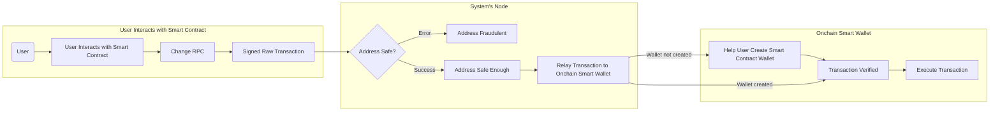

### Anti Scam Relayer

### Contributors

@chee @chen @jin @kay

```mermaid
flowchart LR
  subgraph "User Interacts with Smart Contract"
    A(User) --> B["User Interacts with Smart Contract"]
    B --> C[Change RPC]
    C --> D[Signed Raw Transaction]
  end

  subgraph "System's Node"
    D --> E{Address Safe?}
    E -- Error --> F[Address Fraudulent]
    E -- Success --> G[Address Safe Enough]
    G --> H[Relay Transaction to Onchain Smart Wallet]
  end

  subgraph "Onchain Smart Wallet"
    H -- Wallet not created --> I[Help User Create Smart Contract Wallet]
	  I --> J
    H -- Wallet created --> J[Transaction Verified]
    J --> K[Execute Transaction]
  end

  
```
