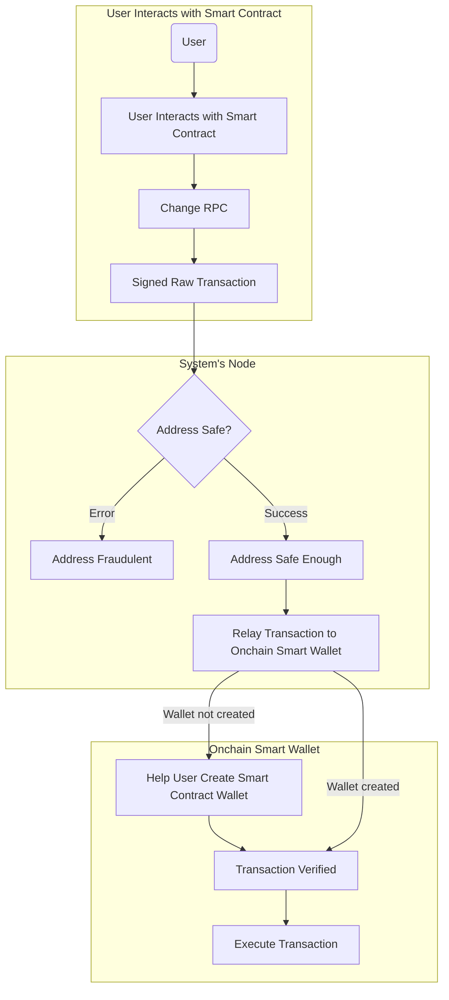

# Safura
An AI powered smart contract wallet that protects user from interacting with malicious contract

## Motivation
Its difficult for non technical people to understand the workings of a smart contract. And scam reports by the public will often takes awhile to be reported and made known. It is important for user to be able to know if the contract that he or she is interacting with has a potential of being a malicious contract

## How we do it?
We have trained a machine learning model to learn about the behaviour and properties of a contract and from its transaction behaviour and the contract's bytecode (WIP) our machine learning model will be able to decide if the contract is malicious or not.

Our onnx file will then be converted to zk circuits using [ezkl](https://docs.ezkl.xyz/) so that we are able to generate a zk proof in order for the user to verify if the result indeed comes from our model. This ensures the correctness of the computation from our machine learning model.

Using this concept as the core, we leverage upon the concepts of account abstraction and we create a smart contract wallet that is able to verify the zk proof generated from our zk circuits.

## Improvement of UX
In order to provide user with a seemless experience from their own Metamask wallet (or any existing wallet), we made changes to our service in a way that user will only need to change the rpc url in their wallet to point to us. 

When a send transaction is being made, the request will be rerouted to our service and we are then able to perform the required analytics on the destination address.

After that, on behalf of the user, we will relay the transaction to the smart contract owned by the user for the intended execution to be executed.

TLDR, in order to have safeguard against malicious contracts, the user will only need to change the rpc url in their wallet

## Flow chart

### Contributors
@chee @chen @jin @kay
